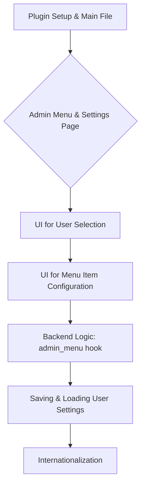

# Simple Custom WP Columns Plugin Plan (Revised: Admin Menu Customization)

### Plugin Name
Simple Custom WP Columns

### Purpose
To provide WordPress administrators with an intuitive way to customize the visibility of admin menu items for individual users, streamlining the dashboard and reducing clutter.

### Key Features
*   **Admin Menu Visibility Control:** Administrators can hide or show specific top-level and sub-menu items in the WordPress admin dashboard.
*   **User-Specific Settings:** Menu visibility settings can be applied on a per-user basis, allowing for tailored admin experiences.
*   **Role-Based Defaults (Future Consideration):** Option to set default menu visibility based on user roles.
*   **Intuitive User Interface:** A simple UI within the WordPress admin area for configuration.

### Problem Solved
This plugin addresses the need for a cleaner, more focused WordPress admin experience. By allowing administrators to hide irrelevant menu items for specific users, it reduces visual clutter, improves navigation, and enhances productivity, especially for users with limited roles or specific tasks.

### Simplicity/Non-Harmful Aspects
The plugin will prioritize simplicity and performance. It will:
*   **Intuitive UI:** Focus on a user-friendly interface that requires no coding knowledge.
*   **Display-Oriented:** Primarily modify the *display* of menu items, not the underlying WordPress core functionality or permissions.
*   **Performance Conscious:** Avoid complex database queries or operations that could negatively impact site performance.
*   **WordPress Standards:** Adhere strictly to WordPress coding standards and best practices for hooks, options, and UI elements to ensure compatibility and stability.

### High-Level Implementation Steps



1.  **Plugin Setup (Main File, Basic Hooks):**
    *   Main plugin file (`idevelop-simple-wp-columns.php`) is already set up.
    *   Ensure activation and deactivation hooks are in place for initial setup and cleanup (e.g., default options).
    *   Initialize plugin classes and load necessary files.

2.  **Admin Menu and Settings Page Creation:**
    *   A top-level or sub-menu page under "Settings" or "Tools" is already registered.
    *   The callback function for rendering the settings page HTML is in place.
    *   Enqueue necessary CSS and JavaScript for the settings page.

3.  **UI for User Selection:**
    *   On the settings page, display a list of all WordPress users.
    *   Allow administrators to select a user to configure their menu visibility.

4.  **UI for Menu Item Configuration:**
    *   For the selected user, display a list of all available admin menu items (top-level and sub-menus).
    *   Each menu item should have a checkbox to hide/show it.
    *   Consider a hierarchical display for sub-menus.

5.  **Backend Logic to Hook into `admin_menu`:**
    *   Dynamically hook into the `admin_menu` action.
    *   Based on the current user's settings, remove or modify global `$menu` and `$submenu` arrays to hide specific menu items.

6.  **Saving and Loading User Settings using User Meta API:**
    *   Store plugin settings (configured menu visibility per user) as user meta using `update_user_meta()` and retrieve with `get_user_meta()`.
    *   Sanitize and validate all incoming settings data before saving.

7.  **Internationalization:**
    *   Implement text domains for all translatable strings using `load_plugin_textdomain()` and `__()`/`_e()`.

### Suggested File Structure (Adjusted)

```
idevelop-simple-wp-columns/
├── idevelop-simple-wp-columns.php  (Main plugin file, loads other files, defines hooks)
├── readme.txt                       (WordPress plugin repository readme)
├── LICENSE.txt                      (Plugin license)
├── assets/                          (Optional: for images, icons)
│   └── icon.svg
├── languages/                       (For translation files)
│   └── idevelop-simple-wp-columns.pot
├── includes/
│   ├── class-scwc-loader.php        (Handles loading actions and filters)
│   ├── class-scwc-admin.php         (Handles admin menu, settings page rendering, enqueue scripts)
│   ├── class-scwc-settings.php      (Handles saving/loading settings, validation - will be updated for user meta)
│   ├── class-scwc-menu-manager.php  (NEW: Handles `admin_menu` hook and menu visibility logic)
│   └── class-scwc-helpers.php       (Utility functions, e.g., getting all users, admin menus)
├── admin/
│   ├── css/
│   │   └── admin-style.css          (Admin-specific CSS)
│   └── js/
│       └── admin-script.js          (Admin-specific JavaScript for UI interactions)
└── templates/
    └── settings-page.php            (Settings page HTML structure)
```

### Complexity Estimate
**Medium to High**

**Justification:**
*   **Low aspects:** Basic plugin setup, admin menu creation, and using the User Meta API are relatively straightforward.
*   **Medium aspects:**
    *   **UI Complexity:** Building a user-friendly interface that allows selecting users and then dynamically displaying and configuring all admin menu items (including sub-menus) will require a moderate amount of JavaScript and PHP logic.
    *   **Dynamic Menu Manipulation:** Correctly manipulating the global `$menu` and `$submenu` arrays to hide items without breaking WordPress functionality requires careful handling.
    *   **User Meta Management:** Storing and retrieving per-user settings efficiently.
*   **High aspects:**
    *   **Comprehensive Menu Traversal:** Accurately identifying and listing all top-level and sub-menu items, especially those added by other plugins, can be complex.
    *   **Edge Cases & Compatibility:** Ensuring the plugin gracefully handles various WordPress versions, other plugins that modify menus, and different user roles will require robust error handling and extensive testing.
    *   **Performance:** Optimizing the menu manipulation logic to avoid performance degradation, especially on sites with many users or plugins.

The core functionality is manageable, but making it robust, user-friendly, and compatible with a wide range of WordPress setups pushes it into the medium to high complexity range.